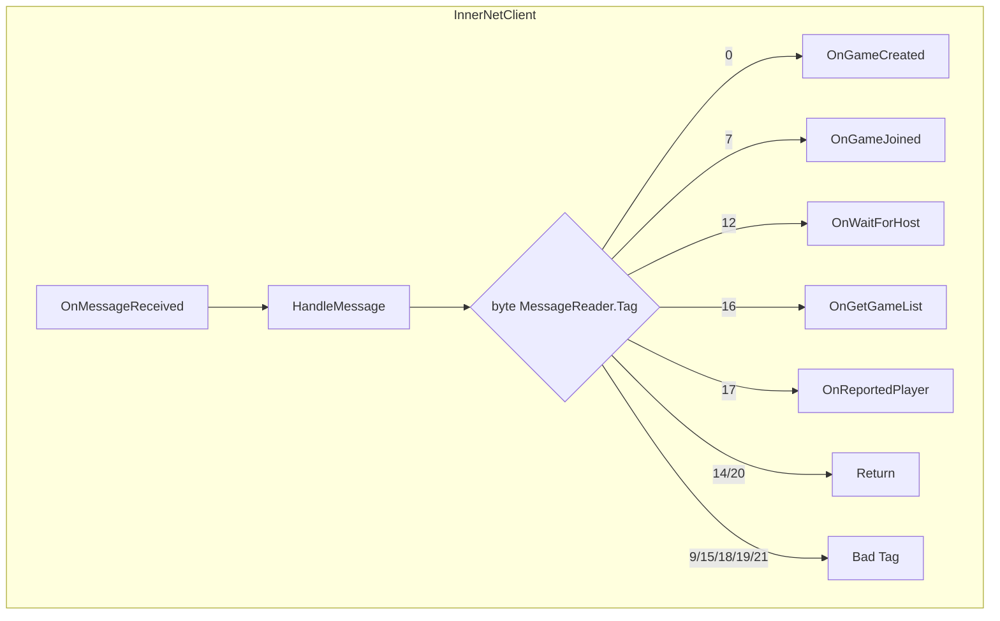
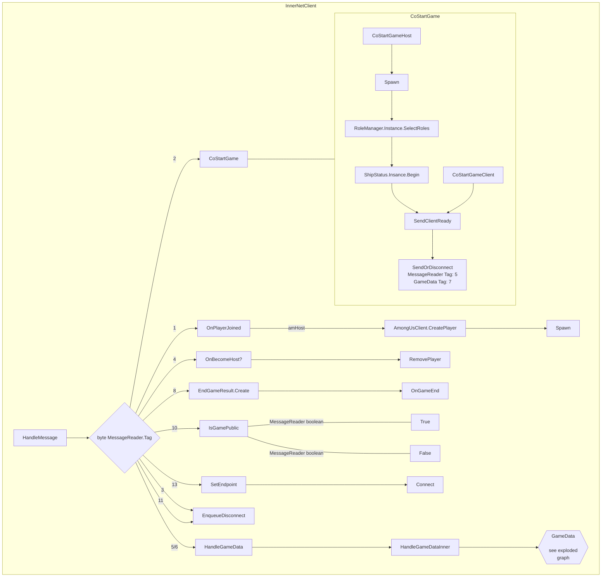

# AUNetworkingDoc
A simple graphical view of Among Us networking Server to client direction

## The straightforward ones


## The slightly more interesting ones


### GameData - InnerNetClient.HandleMessage Reader.Tag = 5 or 6
```mermaid
flowchart LR
subgraph GameData
    direction TB
HandleGameData --> HGDI[HandleGameDataInner] --> GD
  subgraph GD[GameData]
    direction LR
    HandleGameDataInner{byte MessageReader.Tag}
    HandleGameDataInner --> |1|Data[InnerNetObject.Deserialize] --> Deserialize
    HandleGameDataInner --> |2|handleRPC[HandleRPC] --> RPC
    HandleGameDataInner --> |3|BadTag[Bad Tag]
    HandleGameDataInner --> |4|SpawnHGD[CoHandleSpawn]
    HandleGameDataInner --> |5|Despawn[RemoveNetObject] --> Destroy
    HandleGameDataInner --> |6|SceneChange[CoOnPlayerChangedScene]
    HandleGameDataInner --> |7|Ready[Clientdata.IsReady = true]
    HandleGameDataInner --> |207|hgdspl[Default - 207]
    HandleGameDataInner --> |*|any[Default]
  end
  end
  subgraph Deserialize
  direction TB
    CustomNetworkTransform.Deserialize
    ~~~ GameData.Deserialize 
    ~~~ GameManager.Deserialize
    ~~~ LobbyBehaviour.Deserialize
    ~~~ MeetingHud.Deserialize
    ~~~ PlayerControl.Deserialize
    ~~~ ShipStatus.Deserialize
    ~~~ VoteBanSystem.Deserialize
  end
  subgraph RPC
  CustomNetworkTransform.HandleRPC
    ~~~ GameData.HandleRPC
    ~~~ GameManager.HandleRPC
    ~~~ LobbyBehaviour.HandleRPC
    ~~~ MeetingHud.HandleRPC
    ~~~ PlayerControl.HandleRPC
    ~~~ ShipStatus.HandleRPC
    ~~~ VoteBanSystem.HandleRPC
  end
```
